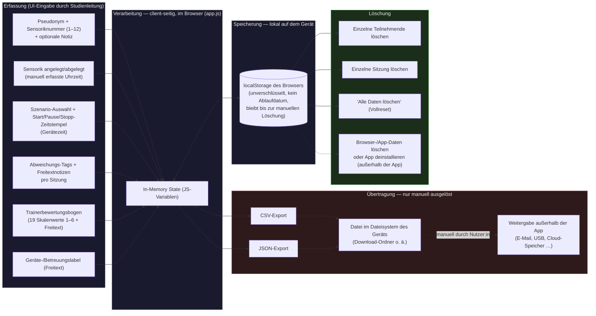

# StudyLog-V2 — Datenfluss (Grundlage für Datenschutz-Bewertung)

> Diese Datei dokumentiert, welche Daten die App erfasst, wo sie entstehen, wie/wo sie
> verarbeitet und gespeichert werden, ob/wohin sie übertragen werden, und wie sie gelöscht
> werden. Offene Punkte sind explizit mit **"TODO: Datenschutz prüfen"** markiert. Diese
> Datei ersetzt keine rechtliche Prüfung, sondern liefert den technischen Ist-Zustand dafür.

## Grundprinzip

Die App verarbeitet alle Daten **ausschließlich lokal im Browser des jeweiligen Geräts**.
Es gibt keinen Server, kein Backend, keine Cloud-Synchronisation und keine automatische
Übertragung an Dritte. Der einzige Weg, Daten aus der App herauszubekommen, ist ein
**manuell ausgelöster CSV/JSON-Export**, der eine Datei auf dem Gerät erzeugt.

Personen werden ausschließlich unter **Pseudonym** (Format erzwungen: 1 Buchstabe, 4 Zahlen,
3 Buchstaben, z. B. `P1234ABC`) und **Sensoriknummer** (1–12) geführt. Die Zuordnung Pseudonym ↔ Klarname wird laut
Projekt-README **außerhalb der App**, separat bei der Studienleitung, geführt — die App
selbst kennt diese Zuordnung nicht. Das entspricht einer Pseudonymisierung nach
Art. 4 Nr. 5 DSGVO, **sofern** die externe Zuordnungsliste tatsächlich getrennt und
zugriffsgeschützt aufbewahrt wird. TODO: Datenschutz prüfen — die Existenz, Aufbewahrung
und Zugriffsberechtigung dieser externen Zuordnungsliste liegt außerhalb des Codes und
kann hier nicht verifiziert werden.

## Diagramm: Datenfluss

Rot hinterlegt (Transfer) markiert den Punkt, ab dem Daten die Kontrolle der App verlassen:
Sobald eine CSV/JSON-Datei exportiert wurde, entscheidet die Studienleitung eigenverantwortlich
und außerhalb der App, wie/wohin diese Datei weitergegeben wird (Zusammenführen mehrerer
Geräte-Exporte laut README z. B. in Excel/R/Python). TODO: Datenschutz prüfen — Aufbewahrung,
Zugriffsschutz und Löschfristen für exportierte Dateien sind nicht Teil der App und sollten
organisatorisch (nicht technisch) geregelt und für die DSFA dokumentiert werden.

## Datentypen im Detail

Gespeichert wird in sechs getrennten `localStorage`-Einträgen (Keys `sl_probanden`,
`sl_sessions`, `sl_settings`, `sl_scenarios`, `sl_tags`, `sl_bewertungen`).

| Datentyp | Felder (Auszug) | Zweck | Rechtsgrundlage | Speicherort | Aufbewahrungsdauer | Verantwortlichkeit |
|---|---|---|---|---|---|---|
| **Teilnehmenden-Stammdaten** (`sl_probanden`) | Pseudonym, Sensoriknummer (1–12), Händigkeit (optional: „Rechts" / „Links" / keine Angabe), optionale Freitextnotiz, Zeitpunkt Sensorik an-/abgelegt, Erstellungszeitpunkt | Zuordnung von Sitzungen zu Testpersonen ohne Klarnamen; Händigkeit relevant für Sensorplatzierung | TODO: Datenschutz prüfen | `localStorage`, lokal auf dem jeweiligen Gerät | Unbegrenzt, bis manuelle Löschung (einzeln oder "Alle Daten löschen") | Jeweilige Studienleitung / Gerätebesitzer:in |
| **Sitzungsprotokolle** (`sl_sessions`) | Verweis auf Teilnehmende:n (Pseudonym+Sensoriknummer als Kopie), gewähltes Szenario, Start-/Endzeitpunkt (ISO 8601), aktive Dauer, Pausen (je Start-/Endzeitpunkt + Dauer, beliebig oft pro Sitzung), Abweichungs-Tags, Freitextnotizen, Gerätelabel | Nachvollziehbarkeit des Sitzungsablaufs inkl. Unterbrechungen, Basis für Auswertung/Export | TODO: Datenschutz prüfen | `localStorage`, lokal | Unbegrenzt, bis manuelle Löschung | Jeweilige Studienleitung / Gerätebesitzer:in |
| **Trainerbewertungsbogen** (`sl_bewertungen`) | Verweis auf Sitzung, 19 Skalenwerte (Schulnoten-Skala 1–6) zu Leistungsdimensionen (u. a. Lageerkundung, Entscheidungsqualität, Führung/Kommunikation, MANV-Erkennung), Freitextanmerkungen | Strukturierte Leistungsbewertung der Teilnehmenden im Szenario | TODO: Datenschutz prüfen — Bewertungsdaten zu einer identifizierbaren (wenn auch pseudonymisierten) Person können besonders schutzwürdig sein | `localStorage`, lokal | Unbegrenzt, bis manuelle Löschung | Jeweilige Studienleitung / Gerätebesitzer:in |
| **Sensorik-Zeiten** (Teil von `sl_probanden`) | Uhrzeit "Sensorik angelegt" / "Sensorik abgelegt" (manuell erfasst, **keine** Rohsensordaten) | Dokumentation des Sensorhandlings im Studienablauf | TODO: Datenschutz prüfen | `localStorage`, lokal | Unbegrenzt, bis manuelle Löschung | Jeweilige Studienleitung / Gerätebesitzer:in |
| **Szenario- & Tag-Konfiguration** (`sl_scenarios`, `sl_tags`) | Name/Abkürzung/Icon der Szenarien, Liste möglicher Abweichungs-Tags | App-Konfiguration, keine Personenbezug | Nicht personenbezogen | `localStorage`, lokal | Unbegrenzt (wird von "Alle Daten löschen" **nicht** erfasst) | Jeweilige Studienleitung / Gerätebesitzer:in |
| **Einstellungen** (`sl_settings`) | Geräte-/Betreuungslabel (Freitext), Zeitpunkt letzter Export, Ein/Aus-Schalter "Mehrere Teilnehmende gleichzeitig" (`multiProband`) | App-Konfiguration und Exportnachweis | Nicht personenbezogen (kann ggf. Namen enthalten, falls Studienleitung sich selbst dort einträgt) | `localStorage`, lokal | Unbegrenzt (wird von "Alle Daten löschen" **nicht** erfasst) | Jeweilige Studienleitung / Gerätebesitzer:in |
| **Export-Dateien** (CSV/JSON) | Kombination aller obigen personenbezogenen Felder inkl. Bewertungswerte | Zusammenführung/Auswertung mehrerer Geräte nach Studienabschluss | TODO: Datenschutz prüfen | Dateisystem des Geräts (Download-Ordner), danach außerhalb der App-Kontrolle | Unbestimmt — liegt außerhalb der App | TODO: Datenschutz prüfen — vermutlich Studienleitung/Institution |

## Löschverhalten im Detail (technisch verifiziert im Code)

- **Einzelne:n Teilnehmende:n löschen:** Entfernt den Stammdatensatz aus `sl_probanden`.
  Bereits gespeicherte Sitzungen (`sl_sessions`) und Bewertungen (`sl_bewertungen`) dieser
  Person **bleiben erhalten** (Pseudonym/Sensoriknummer sind dort als Kopie hinterlegt) —
  die App weist beim Löschen explizit darauf hin. TODO: Datenschutz prüfen — im Hinblick auf
  ein Recht auf Löschung (Art. 17 DSGVO) sollte bewertet werden, ob dieses Verhalten
  gewünscht/ausreichend ist.
- **Einzelne Sitzung löschen:** Entfernt genau diesen Eintrag aus `sl_sessions`. Zugehörige
  Bewertungsbogen-Einträge in `sl_bewertungen` werden dabei **nicht** automatisch mitgelöscht
  (verwaister Verweis über `sessionId` bleibt bestehen). TODO: Datenschutz prüfen.
- **"Alle Daten löschen" (Einstellungen-Screen):** Leert `sl_probanden`, `sl_sessions` und
  `sl_bewertungen` sowie den Zeitstempel des letzten Exports vollständig. **Nicht** betroffen
  sind die Szenario-Konfiguration (`sl_scenarios`), die Tag-Liste (`sl_tags`) und das
  Geräte-/Betreuungslabel sowie der Schalter "Mehrere Teilnehmende gleichzeitig"
  (`sl_settings.deviceLabel`/`sl_settings.multiProband`) — diese gelten als reine
  App-Konfiguration ohne Personenbezug.
- **Kein automatischer Ablauf/keine Aufbewahrungsfrist:** Die App löscht nichts von selbst.
  Daten bleiben im `localStorage` des Browsers bestehen, bis eine der obigen Aktionen manuell
  ausgeführt wird, oder bis Nutzer:innen außerhalb der App Browserdaten löschen bzw. die App
  deinstallieren (browser-/betriebssystemabhängig, nicht von der App steuerbar).
- **Keine Verschlüsselung durch die App:** `localStorage` wird unverschlüsselt durch die App
  genutzt; ein etwaiger Schutz hängt von Geräteverschlüsselung/Bildschirmsperre des jeweiligen
  Endgeräts ab. TODO: Datenschutz prüfen.

## Offene Punkte (Zusammenfassung)

- TODO: Datenschutz prüfen — Rechtsgrundlage(n) der Verarbeitung (vermutlich Einwilligung
  und/oder wissenschaftliches Forschungsinteresse) sind nicht in der App/im Code hinterlegt.
- TODO: Datenschutz prüfen — Existenz, Speicherort und Schutz der externen
  Pseudonym-↔-Klarname-Zuordnungsliste liegen außerhalb des Codes.
- TODO: Datenschutz prüfen — Umgang mit exportierten CSV/JSON-Dateien nach dem Download
  (Aufbewahrung, Löschfristen, Zugriffsschutz) ist organisatorisch, nicht technisch geregelt.
- TODO: Datenschutz prüfen — kein Lösch-Automatismus/keine Aufbewahrungsfrist innerhalb der App.
- TODO: Datenschutz prüfen — Löschen einzelner Teilnehmender/Sitzungen entfernt verknüpfte
  Datensätze (Sitzungen bzw. Bewertungen) nicht automatisch mit.
