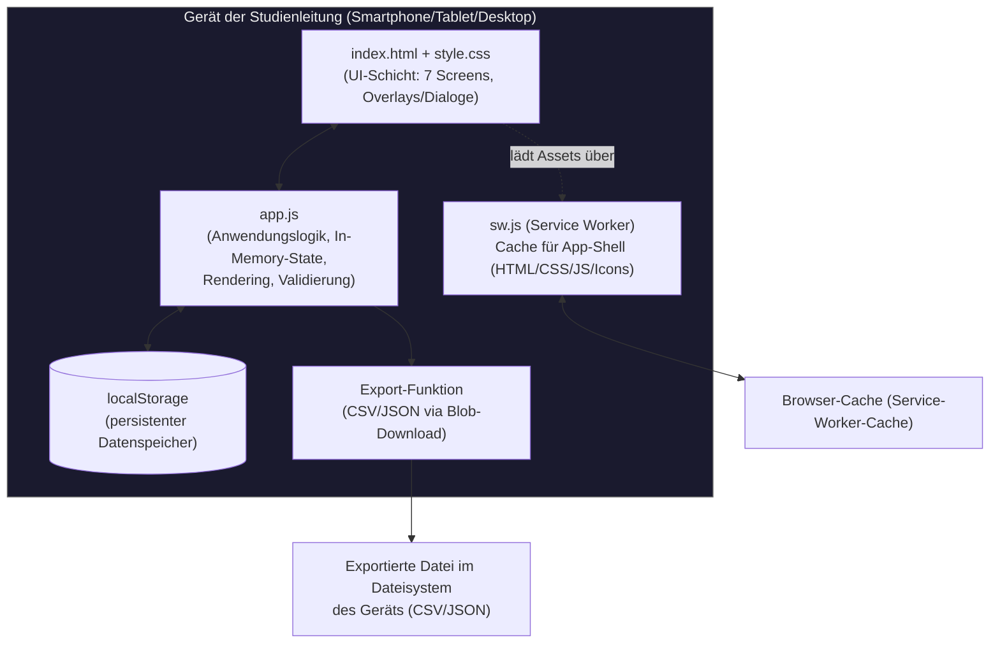

# StudyLog-V2 — Überblick

> Teil der technischen Dokumentation in `/docs`. Zielgruppe: neue Entwickler:innen,
> KI-Modelle ohne Chatverlauf, sowie Grundlage für eine datenschutzrechtliche Bewertung
> (DSGVO / Datenschutzfolgenabschätzung). Siehe auch [DATENFLUSS.md](./DATENFLUSS.md),
> [ARCHITECTURE.md](./ARCHITECTURE.md), [BEDIENUNG.md](./BEDIENUNG.md).

## Zweck (für Laien)

StudyLog ist ein digitales Protokollheft für Studienleitende, die Testpersonen durch
VR-gestützte Trainings- und Bewertungsszenarien führen (im Auslieferungszustand die
Szenarien Tutorial, Hologate und Rollercoaster). Statt Papierbögen wird auf dem Smartphone
gestoppt, notiert und bewertet, wer wann welches Szenario durchlaufen hat — inklusive
eines strukturierten Bewertungsbogens für die durchführende Trainingsleitung. Alle Daten
bleiben dabei ausschließlich auf dem jeweiligen Gerät.

## Zielgruppe / Anwendungskontext

- **Nutzende:** Studienleitungen / Trainer:innen, die vor Ort (z. B. an einer VR-Station)
  Sitzungen mit Teilnehmenden durchführen und protokollieren.
- **Betroffene Personen:** Teilnehmende (Proband:innen) an VR-Trainingsszenarien, die
  ausschließlich unter einem Pseudonym (festes Format: 1 Buchstabe, 4 Zahlen, 3 Buchstaben,
  z. B. `P1234ABC`) geführt werden — optional zusätzlich eine Sensoriknummer (1–12). Keine
  Klarnamen in der App.
- **Einsatzkontext:** Mehrere Studienleitungen nutzen die App parallel auf eigenen
  Smartphones/Tablets, jeweils unabhängig voneinander, vollständig offline. Es gibt keine
  zentrale, geräteübergreifende Instanz der App.
- **Themenfeld der Szenarien:** im Auslieferungszustand Tutorial, Hologate, Rollercoaster
  (früher VR-Welt / Verkehrsunfall / Krankenhaus; über den Szenario-Manager frei änderbar).
  Der eingebaute Trainerbewertungsbogen (Dimensionen "Lageerkundung", "Entscheidungsqualität",
  "Führung und Kommunikation" u. a., inkl. des Begriffs "MANV") deutet weiterhin auf einen
  Einsatz im Bereich Rettungswesen/Notfalltraining hin.
  TODO: Datenschutz prüfen — konkreter Studienkontext und Rechtsgrundlage der
  Datenverarbeitung sind der App selbst nicht zu entnehmen und sollten für eine DSFA
  gesondert dokumentiert werden.

## Technischer Aufbau

| Aspekt | Ausprägung |
|---|---|
| Sprachen | Vanilla JavaScript (ES6+), HTML5, CSS3 |
| Frameworks/Libraries | **Keine** — kein React/Vue/jQuery, kein Build-Tool, kein Bundler |
| Build-Schritt | **Keiner** — Dateien werden unverändert ausgeliefert |
| Datenhaltung | Ausschließlich `localStorage` des Browsers (Web Storage API), geräte- und browserlokal |
| Offline-Fähigkeit | Service Worker (`sw.js`), Cache-first-Strategie |
| Plattform | Progressive Web App (PWA), installierbar auf iOS/Android/Desktop über "Zum Home-Bildschirm" |
| Deployment | Statisches Hosting via GitHub Pages, kein eigener Server |
| Externe Dienste/APIs | **Keine.** Keine Netzwerkaufrufe zu Drittsystemen, kein Tracking, keine Analytics, kein Backend |
| Hardware-Abhängigkeiten | Keine direkte Hardware-Anbindung durch die App selbst (siehe Hinweis unten zu "Sensorik") |
| Sprache der Oberfläche | Deutsch |

**Wichtiger Hinweis zu "Sensorik":** Die App liest keine Sensor-/Messdaten (z. B. Eyetracking,
Bewegungsdaten) aus. "Sensoriknummer", die Felder "Sensorik angelegt/abgelegt" und die
Checkliste im Tab **Sensorik** (Items Shimmer ECG / Shimmer GSR+ / Polar Brustgurt / Garmin
mit jeweiligem Anlege-Zeitpunkt **je Teilnehmende:r**) sind **manuell durch die Studienleitung erfasste Metadaten**
(welche nummerierte Sensor-Hardware-Einheit einer Person zugeordnet wurde, und wann welche
Sensorik an-/abgelegt wurde) — nicht die Rohdaten des Sensors selbst. Details siehe
[DATENFLUSS.md](./DATENFLUSS.md).

## Architekturübersicht (High-Level)

Es gibt **keine Server-Komponente** und **keine Kommunikation zwischen Geräten**. Jede
Installation der App ist eine eigenständige, isolierte Instanz. Der einzige Weg, Daten von
einem Gerät wegzubekommen, ist der manuelle CSV/JSON-Export (siehe
[DATENFLUSS.md](./DATENFLUSS.md)).

### Module/Komponenten

| Datei | Rolle |
|---|---|
| `index.html` | App-Shell: alle 7 Screens (Teilnehmende, Sensorik, Szenario [Screen-ID `session`], Protokoll, Bewertung, Export, Einstellungen) sowie alle Overlays/Dialoge als statisches Markup, anfangs versteckt (`.hidden`) |
| `style.css` | Dark-Mode-Design, responsives Layout (Sidebar auf Desktop/Tablet, Bottom-Nav auf Mobile) |
| `app.js` | Gesamte Anwendungslogik: State-Verwaltung, Persistenz (`localStorage`), Rendering aller Screens, Event-Handling, Export |
| `sw.js` | Service Worker: cached die App-Shell-Dateien für Offline-Nutzung, Cache-Invalidierung über Versionsnummer |
| `manifest.json` | PWA-Manifest (Name, Icons, Startverhalten) |
| `icons/` | App-Icons für Homescreen-Installation |

Details zu Modulen und Datenmodellen: siehe [ARCHITECTURE.md](./ARCHITECTURE.md).
